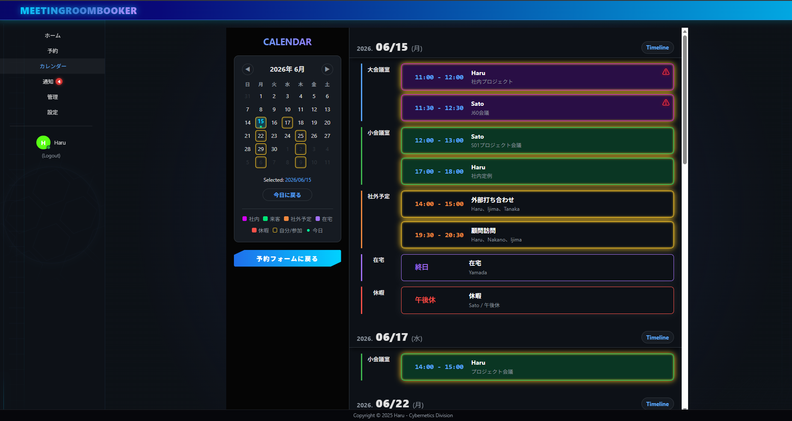
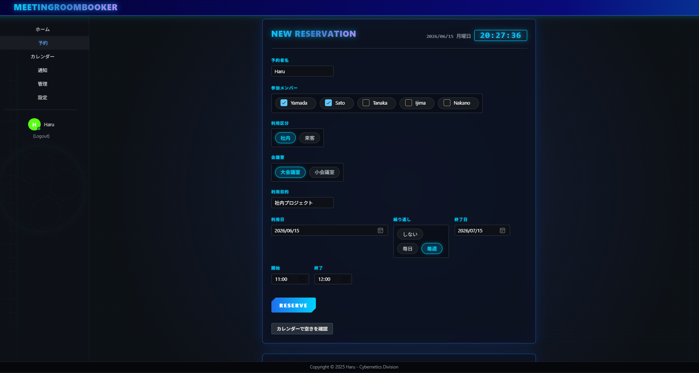
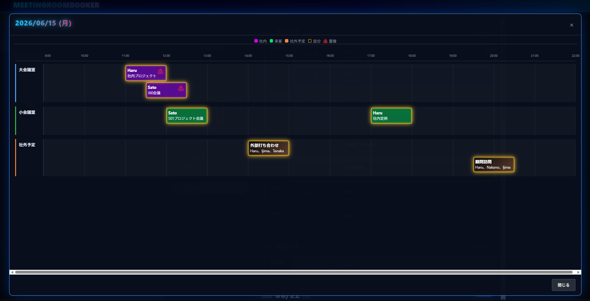
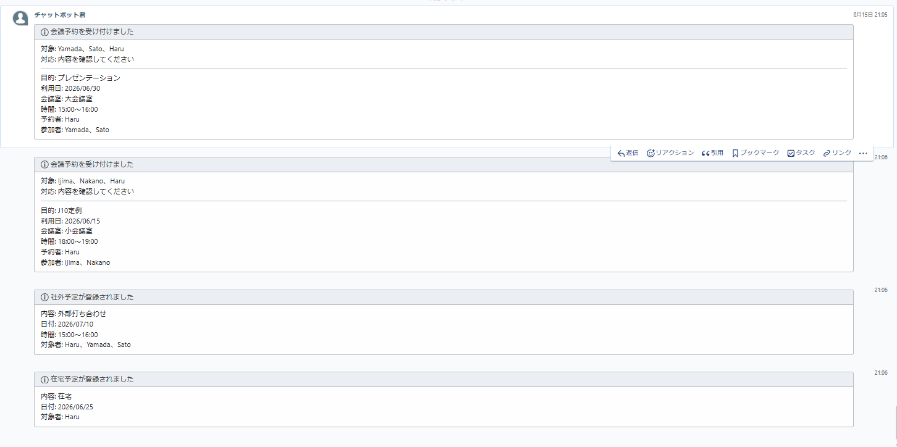

# MeetingRoomBooker

## Overview

MeetingRoomBooker is a meeting room booking and employee schedule management system built for a small internal team.

The system was created from a real operations problem. Meeting room reservations, external appointments, work-from-home schedules, and leave schedules were originally managed together in TimeTree. That made room availability hard to read, made it unclear who was responsible for each reservation, and sometimes led to duplicate bookings.

MeetingRoomBooker separates room reservations from employee schedules while still showing them together when users need context. It also keeps important rules on the API side, including room conflict validation, authorization checks, recurring reservation handling, and notification delivery.

## Why I built it

The original workflow was not only a UI problem. The main issues were mixed schedule types, missed change sharing, unclear responsibility, and weak permission boundaries.

MeetingRoomBooker was designed around the roles involved in daily operation:

- reservation owners who create and update bookings
- participants who need to know when schedules change
- admins who manage users and can handle exceptions
- operations users who need visibility into conflicts and follow-up work

Room conflicts and participant schedule conflicts are treated as different concepts. A room conflict blocks a reservation on the API side. A participant conflict is shown as a warning because some internal schedules can intentionally overlap.

Recurring reservations were added because regular meetings were part of the real workflow. In-app notifications and Chatwork notifications are handled separately so the app can track internal state while also sending direct messages when external delivery is enabled.

## Screenshots

Screenshots use demo data and do not include production secrets.

### Schedule overview

The schedule screen shows room reservations, external appointments, work-from-home schedules, leave, and conflict warnings in one place.

<p align="center">
  
</p>

### Reservation form

The reservation form supports room selection, participants, purpose, date and time, and recurring reservation settings.

<p align="center">
  
</p>

### Timeline conflict view

The timeline view separates room usage and external schedules by time. Warning icons make overlapping participant schedules visible without treating them as room conflicts.

<p align="center">
  
</p>

### Chatwork notification example

Chatwork notifications are sent from the backend when configured. Delivery is tracked per user.

<p align="center">
  
</p>

## Key features

- Meeting room reservations with date, time, room, purpose, owner, and participants
- API-side conflict validation for overlapping reservations in the same room
- Warning-based participant conflicts for overlaps with employee schedules
- Daily and weekly recurring reservations with scoped update and delete behavior
- Employee work schedules for external appointments, work-from-home schedules, and leave
- In-app notifications for reservation and work schedule changes
- Chatwork direct notifications for affected users when integration is enabled
- Delivery keys and delivery logs for duplicate notification prevention and failure tracking
- Cookie-based authentication with server-side authorization checks
- Admin user management and Chatwork user mapping
- Operations Web UI for room conflict management workflows

## Architecture

```text
MeetingRoomBooker.Web
  Blazor WebAssembly client
  Reservation, schedule, notification, settings, and admin UI

MeetingRoomBooker.Api
  ASP.NET Core Web API
  Authentication, authorization, reservations, work schedules,
  notifications, Chatwork delivery, background workers, and EF Core persistence

MeetingRoomBooker.Shared
  Shared DTOs and models used by the API and Blazor client

MeetingRoomBooker.Tests
  xUnit tests for service rules, controller behavior, validation,
  notifications, and conflict handling

MeetingRoomBooker.OperationsWeb
  React / TypeScript / Vite UI for operations workflows

SQLite
  EF Core-backed persistence for the small VPS-based deployment
```

The frontend helps users catch mistakes early, but the backend is the source of truth for room conflicts, permissions, notification targets, and recurring reservation behavior.

## Technical highlights

### Conflict handling

Room conflicts are blocking conflicts. The API checks the same room, same date, and overlapping time range before saving a reservation.

Participant conflicts are warning-based. A participant may already have a work schedule entry, such as an external appointment, work-from-home schedule, or leave. The system surfaces that risk without always blocking the operation.

### Recurring reservations

Recurring reservation logic is handled on the backend. Users can update or delete a single occurrence, this and following occurrences, or the whole series. This keeps the UI from becoming the source of truth for repeated data changes.

### Notifications

In-app notifications and Chatwork notifications are separate concerns. In-app notifications are tied to reservations or work schedule entries. Chatwork delivery is treated as an external integration that can fail per user.

Each Chatwork delivery uses a delivery key and a delivery log. This allows duplicate sends to be skipped and failed deliveries to be inspected without blocking other users.

### Authentication and authorization

The API uses cookie authentication and server-side permission checks. Regular users can manage their own reservations and schedules. Admin-only behavior stays behind API authorization rules.

### Data and deployment safety

The project uses SQLite and EF Core migrations for a small internal deployment. Migration and deployment notes are written with backup and rollback thinking in mind because a local SQLite file can be easy to damage if handled casually.

## Tech stack

### Frontend

- Blazor WebAssembly
- Microsoft Fluent UI for Blazor
- Shared C# models
- React / TypeScript / Vite for Operations Web

### Backend

- C# / .NET 8
- ASP.NET Core Web API
- Entity Framework Core
- Cookie Authentication
- Hosted services for background workers

### Database and infrastructure

- SQLite
- EF Core migrations
- GitHub Actions
- nginx and systemd for the small VPS-based deployment

## Testing

The repository includes xUnit tests for the business rules that are most likely to cause operational problems.

Covered areas include:

- reservation access rules
- reservation overlap checks
- controller-based room conflict detection
- recurring reservation behavior
- room conflict record management
- work schedule validation and permission behavior
- in-app notification rules
- Chatwork notification behavior and duplicate delivery prevention

GitHub Actions run build and test checks for the .NET solution. Operations Web also has a frontend build workflow.

```bash
dotnet build MeetingRoomBooker.slnx
dotnet test MeetingRoomBooker.slnx
```

## Local development

### Prerequisites

- .NET 8 SDK
- Visual Studio 2022 or VS Code
- Node.js for Operations Web development

### Run the API

```bash
cd MeetingRoomBooker.Api
dotnet restore
dotnet run
```

### Run the Blazor Web app

```bash
cd MeetingRoomBooker.Web
dotnet restore
dotnet run
```

### Run Operations Web

```bash
cd MeetingRoomBooker.OperationsWeb
npm install
npm run dev
```

## Security and privacy notes

- Chatwork API tokens are handled on the backend and are not sent to the frontend.
- Production secrets, real Chatwork tokens, private room IDs, production database files, and private server values should not be committed.
- Screenshots should use demo data only.
- Production database changes should be made with backups, verification, and rollback steps prepared.
- The project is designed for a small internal deployment, not for high-concurrency public scheduling.

## Future improvements

Implemented behavior is intentionally separated from future work. Areas not implemented yet, or worth improving next, include:

- end-to-end tests for core reservation flows
- richer audit logs for admin actions
- better observability around notification delivery failures
- stronger database-level guarantees if concurrent usage grows
- a PostgreSQL migration path if the system grows beyond a small internal SQLite deployment
- clearer demo data and screenshots for public portfolio review
